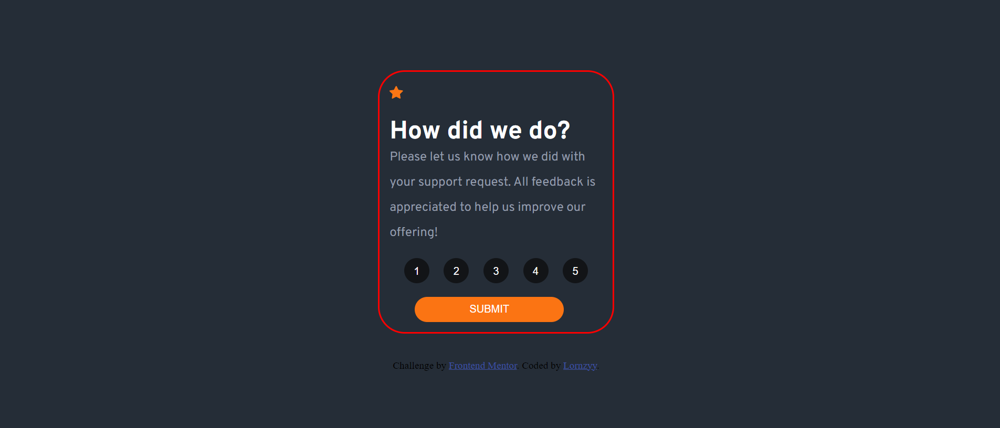

# Frontend Mentor - Interactive rating component solution

This is a solution to the [Interactive rating component challenge on Frontend Mentor](https://www.frontendmentor.io/challenges/interactive-rating-component-koxpeBUmI). Frontend Mentor challenges help you improve your coding skills by building realistic projects. 

### The challenge

Users should be able to:

- View the optimal layout for the app depending on their device's screen size
- See hover states for all interactive elements on the page
- Select and submit a number rating
- See the "Thank you" card state after submitting a rating

### Screenshot



### Links

- Solution URL: [Add solution URL here](https://your-solution-url.com)
- Live Site URL: [Add live site URL here](https://your-live-site-url.com)


### What I learned
I learnt how to use class within javascript and additionally I was able to reset to allow rating again without refreshing the page.

Here is a snapshot

```js
ratingBtn.addEventListener("click", function(){
    return (
        thankyouState.classList.add("hidden"),
        containerEl.style.display = "block"
    )
});
```

### Continued development

I plan to focus on learning the foreach loop in javascript as I was unable to do so and resorted to use the for loop which I have a better understanding of.

## Author

- Website - [Lorna](https://)
- Frontend Mentor - [@Lornzyy](https://www.frontendmentor.io/profile/Lornzyy)
- Twitter - [@Lornzyy](https://www.twitter.com/Lornzyy)

